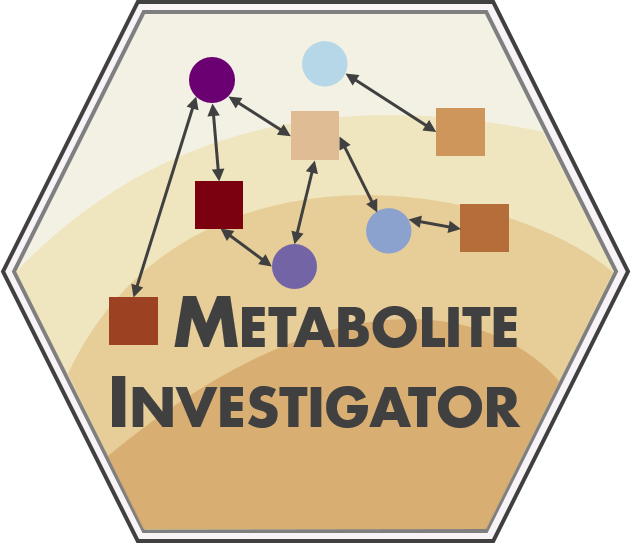

# Metabolite-Investigator



## Description

This is a Shiny-App with the aim of facilitating association and covariate selection for targeted metabolomics data from multiple studies with a wide range of factors (demographic, lifestyle, etc.). A detailed description of the implemented methods can be found [here](https://academic.oup.com/bioinformatics/advance-article/doi/10.1093/bioinformatics/btaa967/5983322). Features of the App are:

A detailed description of the methods used in the analysis as well as an application with data for 63 metabolites and 29 factors in three studies (N=16,222) is integrated in the LHA ([Leipzig Health Atlas](https://www.health-atlas.de/)) [here](https://www.health-atlas.de/models/23).

* Upload of data (with seperate files for metabolite and factor data)
* Matching via ID overlap
* Preprocessing of data in each cohort including
  + Removal of outliers defined as values +5 times the sample standard deviation (5*SD) on log-transformed data
  + Inverse-normal-transformation of data to remove skew while regainig data structure (concerning zero-inflated values)
  + Nonparametric batch-adjustment via an empirical Bayes method ([sva::ComBat](https://bioconductor.org/packages/release/bioc/html/sva.html))
* Univariable association step of each metabolite with each factor in each cohort (Metabolite_i ~ Factor_j)
* Univariable test for interaction of each factor with the cohort term (Metabolite_i ~ Factor_j + cohort + Factor_j*cohort)
* Correlation check and user guided descision on exclusion of too highly correlating factors
* Multivariable association step of each metabolite with all factors in each cohort (Metabolite_i ~ Factor_1 + Factor_2 + ... Factor_J)
* Multivariable test for interaction of each factor with the cohort term (Metabolite_i ~ Factor_1 + Factor_2 + ... Factor_J + Factor_1\*cohort + ... + Factor_J\*cohort + cohort)
* Selection of covariates for subsequent analyses of metabolites by removing factors not explaining a set amount of variance in at least one metabolite in at least one cohort via backwards selection until only factors meeting the explained variance criteria remain in the model 
* Visualization of results
* Sample and feature-centric annotation
* Download of results

## Quick-Start

The App is hosted on the LHA-Servers [here](https://apps.health-atlas.de/metabolite-investigator/). Otherwise, it can be started directly from this repository via:

```r
# to install shiny run:
# install.packages("shiny")
# load the Shiny package
library("shiny")

# Start the App directly through Github
runGitHub("Metabolite-Investigator", "cfbeuchel")
```

For local offline use the the application needs to be downloaded, the ZIP-file extracted an run like this:

```r
# to install shiny run:
# install.packages("shiny")
# load the Shiny package
library("shiny")

# start the App from the previously downloaded folder, e.g.
runApp("C:\Users\cfbeuchel\Downloads\Metabolite-Investigator-master")

# or on unix based systems for example:
runApp("/home/cfbeuchel/Downloads/Metabolite-Investigator-master")
```

Replace the directory within the brackets with location of the folder on your system. Make sure the path points to the folder containing the `app.R`, `server.R` and `ui.R` scripts.

The App comes with example data from two cohorts that may be used to try out
the functionality. Press the `Use Example Data` button to load the data and try out the application. 

## Docker Archive

For backwards-compatibility, we also offer a docker archive of previous versions of the app [on GitLab](https://gitlab.com/imise-genstat/metabolite-investigator-archive/container_registry/1612096) (starting from Version 0.1.6). These docker-images can be pulled from the archive and run within a working docker environmnent as follows:

1. Go to https://gitlab.com/imise-genstat/metabolite-investigator-archive/container_registry/1612096
2. Look for a tagged version you would like to run using docker
3. The download link for the docker command is available at the "clipboard"-symbol next to the tag-name (e.g. 0.1.6)
4. Use the `docker pull` command to download the selected image to your computer
5. Run a local version of the downloaded image

```
# Using the initial release version 0.1.6 as an example: 
docker pull registry.gitlab.com/imise-genstat/metabolite-investigator-archive:0.1.6
docker run -it -p 3838:3838 registry.gitlab.com/imise-genstat/metabolite-investigator-archive:0.1.6
```

## Requirements

The app requires an [up-to-date R installation](https://www.r-project.org/) as well as the following
packages:

* shiny  (install via CRAN - `install.packages("shiny")`)
* DT  (install via CRAN - `install.packages("DT")`)
* BiocManager  (install via CRAN - `install.packages("BiocManager")`)
* sva (install via
  [Bioconductor](https://bioconductor.org/packages/release/bioc/html/sva.html))
* data.table (install via CRAN - `install.packages("data.table")`)
* visNetwork (install via CRAN - `install.packages("visNetwork")`)
* magrittr (install via CRAN - `install.packages("magrittr")`)
* ggplot2 (install via CRAN - `install.packages("ggplot2")`)
* corrplot (install via CRAN - `install.packages("corrplot")`)
* scales (install via CRAN - `install.packages("scales")`)

## References

**This App could only be programmed by using these freely available tools:**

* Martin Morgan (2018). BiocManager: Access the Bioconductor Project Package Repository. R package version 1.30.4.
  https://CRAN.R-project.org/package=BiocManager
* Yihui Xie, Joe Cheng and Xianying Tan (2019). DT: A Wrapper of the JavaScript Library 'DataTables'. R package version 0.11.
  https://CRAN.R-project.org/package=DT
* Jeffrey T. Leek, W. Evan Johnson, Hilary S. Parker, Elana J. Fertig, Andrew E. Jaffe, John D. Storey, Yuqing Zhang and Leonardo Collado Torres
  (2019). sva: Surrogate Variable Analysis. R package version 3.30.1.
* Matt Dowle and Arun Srinivasan (2019). data.table: Extension of `data.frame`. R package version 1.12.2.
  https://CRAN.R-project.org/package=data.table
* Almende B.V., Benoit Thieurmel and Titouan Robert (2019). visNetwork: Network Visualization using 'vis.js' Library. R package version 2.0.6.
  https://CRAN.R-project.org/package=visNetwork
* Stefan Milton Bache and Hadley Wickham (2014). magrittr: A Forward-Pipe Operator for R. R package version 1.5.
  https://CRAN.R-project.org/package=magrittr
* H. Wickham. ggplot2: Elegant Graphics for Data Analysis. Springer-Verlag New York, 2016.
* Taiyun Wei and Viliam Simko (2017). R package "corrplot": Visualization of a Correlation Matrix (Version 0.84). Available from
  https://github.com/taiyun/corrplot
* Hadley Wickham (2018). scales: Scale Functions for Visualization. R package version 1.0.0. https://CRAN.R-project.org/package=scales
* R Core Team (2018). R: A language and environment for statistical computing. R Foundation for Statistical Computing, Vienna, Austria. URL
  https://www.R-project.org/.
* Winston Chang, Joe Cheng, JJ Allaire, Yihui Xie and Jonathan McPherson (2019). shiny: Web Application Framework for R. R package version 1.3.0.
  https://CRAN.R-project.org/package=shiny
* Achim Zeileis, Torsten Hothorn (2002). Diagnostic Checking in Regression Relationships. R News 2(3), 7-10. URL
  https://CRAN.R-project.org/doc/Rnews/
